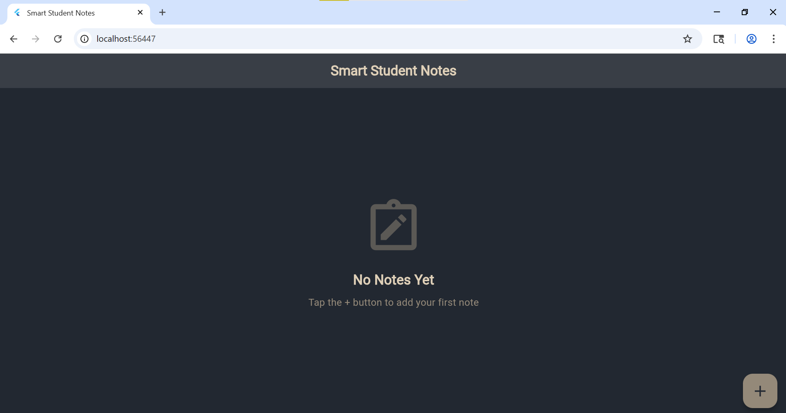
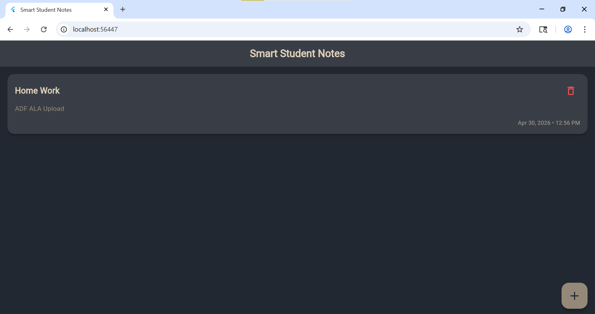
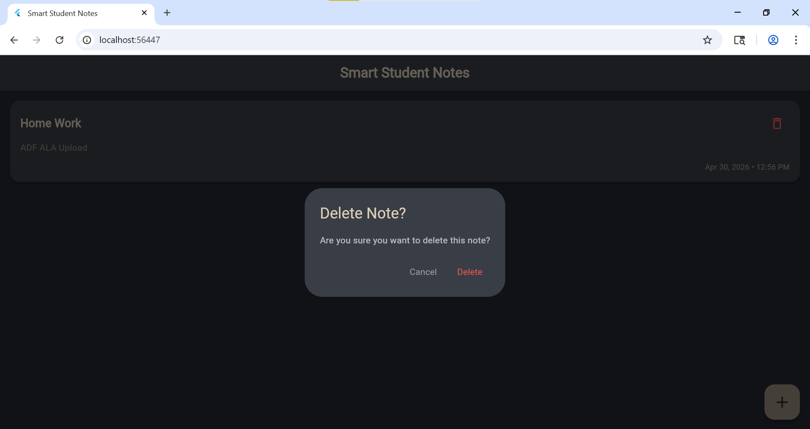

# Smart Student Notes 📱

A modern, fast, and beautiful Flutter application designed for students to manage their academic notes locally. Built with performance and aesthetics in mind, using Hive for persistent storage.

## 🎯 Features

- **Full CRUD Operations**: Create, Read, Update, and Delete notes.
- **Local Persistence**: Data remains safe on your device even after restarting the app.
- **Modern UI/UX**: Dark-themed elegant design with a premium color palette.
- **Smooth Animations**: Transitions and state changes are animated for a better user experience.
- **Empty State UI**: Informative screen when no notes are present.
- **Confirmation Dialogs**: Prevents accidental deletion of important notes.
- **Splash Screen**: Professional entry point with branding.

## 🎨 Design Palette

| Color | Hex Code | Usage |
|-------|----------|-------|
| Dark Gray | `#222831` | Background |
| Charcoal | `#393E46` | Cards & AppBar |
| Muted Tan | `#948979` | Primary Accents |
| Beige | `#DFD0B8` | Text & Highlights |

## 🛠️ Tech Stack

- **Framework**: [Flutter](https://flutter.dev)
- **Database**: [Hive](https://pub.dev/packages/hive) (NoSQL)
- **State Management**: `setState` (Optimized for simplicity)
- **Formatting**: `intl` for date formatting
- **Icons**: Material Design Icons

## 📂 Project Structure

```
lib/
 ├── main.dart             # App entry point & Theme configuration
 ├── models/               # Data models (Note)
 ├── screens/              # UI Screens (Home, Splash)
 ├── services/             # Logic & Database interactions (Hive)
 └── widgets/              # Reusable UI components (NoteCard, EmptyState)
```

## 🚀 How to Run

1. **Clone the repository**:
   ```bash
   git clone https://github.com/yourusername/smart_notes_app.git
   ```

2. **Navigate to the project directory**:
   ```bash
   cd smart_notes_app
   ```

3. **Install dependencies**:
   ```bash
   flutter pub get
   ```

4. **Run the app**:
   ```bash
   flutter run
   ```

## 📸 Screenshots

### 🏠 Home Screen


### ➕ Add Note


### ✏️ Edit Note


### 🗑️ Delete Note


## 🧪 Automated Screenshots

This project uses Flutter `integration_test` to automatically capture UI screenshots.

### How to run screenshot automation:

1. Ensure an Android Emulator or iOS Simulator is running.
2. Run the following command:
   ```bash
   flutter drive --driver=test_driver/screenshot_driver.dart --target=integration_test/app_test.dart
   ```
3. The screenshots will be automatically saved to the `assets/images/` folder.

---
Developed with ❤️ for students.
